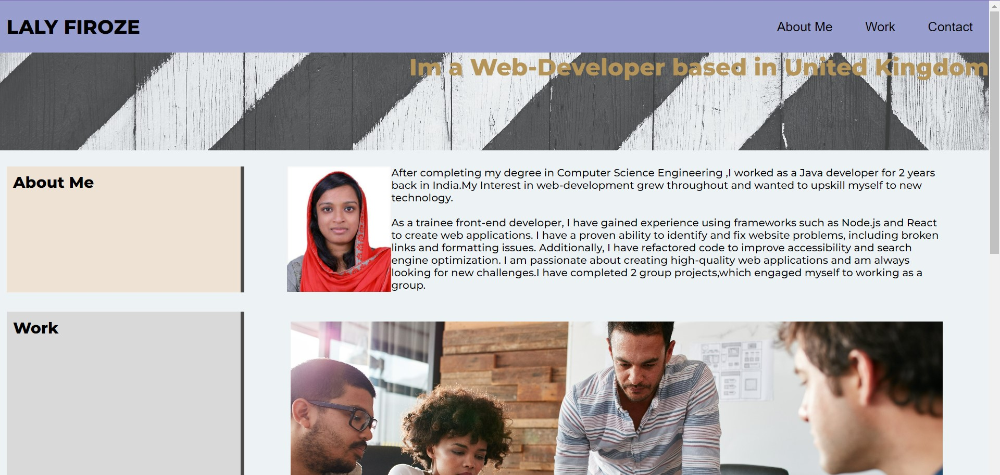

## Basic Portfolio

Portfolio showcases my talents, abilities, and application of recent skills such as flexbox, media queries, and CSS variables. This will allow me to demonstrate my expertise and use my newly acquired skills while creating something that will be useful in my job search. The portfolio will be a powerful tool that demonstrates my capabilities and helps me stand out in the job market.

## Acceptance Criteria

+ When the page is loaded the page presents your name, a recent photo or avatar, and links to sections about you, your work, and how to contact you
+ When one of the links in the navigation is clicked then the UI scrolls to the corresponding section
+ When viewing the section about your work then the section contains titled images of your applications
+ When presented with the your first application then that application's image should be larger in size than the others
+ When images of the applications are clicked then the user is taken to that deployed application
+ When the page is resized or viewed on various screens and devices then the layout is responsive and adapts to my viewport

## Screenshot

## Link
Live Link:  https://lalyf.github.io/Basic-Portfolio/

Github Url: https://github.com/LalyF/Basic-Portfolio.git

## Technologies used

+ Semantic HTML5 markup
+ CSS custom properties
+ Flexbox
+ CSS Grid
+ Mobile-first workflow

## Useful resources:

W3schools: https://www.w3schools.com/css

## Author
Laly Firoze